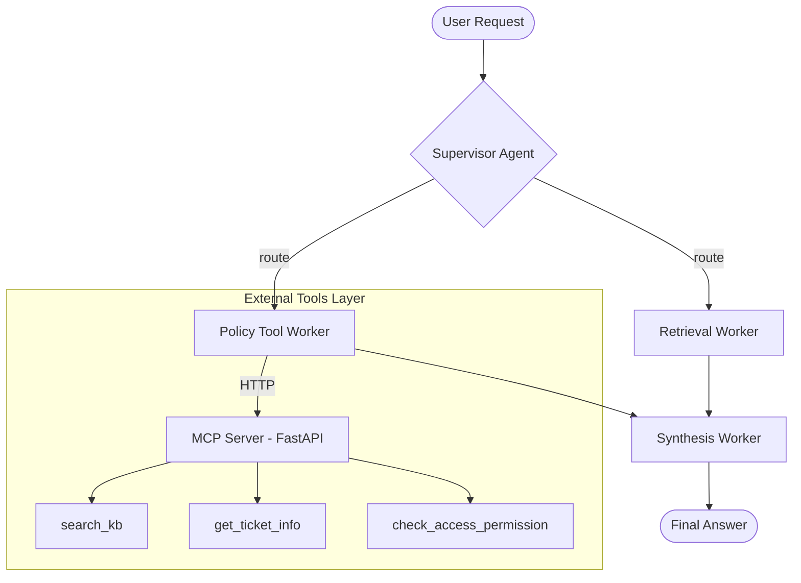

# System Architecture — Lab Day 09

**Nhóm:** 5 - E402  
**Ngày:** 14/04/2026  
**Version:** 1.0

---

## 1. Tổng quan kiến trúc

Kiến trúc hệ thống được thiết kế theo mô hình **Multi-Agent Orchestration**, tập trung vào khả năng chuyên môn hóa của từng đơn vị thực thi (Workers) dưới sự điều phối của một bộ não trung tâm (Supervisor).

**Pattern đã chọn:** Supervisor-Worker  
**Lý do chọn pattern này (thay vì single agent):**
- **Độ chính xác cao:** Ngăn chặn việc LLM bị "loãng" ngữ cảnh khi phải xử lý quá nhiều tài liệu cùng lúc.
- **Khả năng mở rộng:** Dễ dàng tích hợp thêm các công cụ bên thứ ba (qua MCP) mà không cần thay đổi logic của toàn bộ pipeline.
- **Explainability:** Cung cấp lý do định tuyến (route_reason) cho mọi quyết định.

---

## 2. Sơ đồ Pipeline

Hệ thống điều phối dữ liệu qua một Graph tập trung, hỗ trợ cả Human-in-the-loop và MCP Server.

---

## 3. Vai trò từng thành phần

### Supervisor (`graph.py`)

| Thuộc tính | Mô tả |
|-----------|-------|
| **Nhiệm vụ** | Phân loại ý định người dùng và định tuyến câu hỏi. |
| **Input** | `AgentState` containing the user task. |
| **Output** | supervisor_route, route_reason, risk_high, needs_tool |
| **Routing logic** | Sử dụng LLM-based classifier kết hợp bộ từ khóa chuyên biệt. |
| **HITL condition** | Kích hoạt khi `risk_high=True` hoặc gặp lỗi hệ thống (ERR-xxx). |

### Retrieval Worker (`workers/retrieval.py`)

| Thuộc tính | Mô tả |
|-----------|-------|
| **Nhiệm vụ** | Tra cứu thông tin tĩnh từ Knowledge Base qua Vector Search. |
| **Embedding model** | text-embedding-3-small |
| **Top-k** | 3 - 5 |
| **Stateless?** | Yes |

### Policy Tool Worker (`workers/policy_tool.py`)

| Thuộc tính | Mô tả |
|-----------|-------|
| **Nhiệm vụ** | Xử lý các yêu cầu liên quan đến chính sách, hoàn tiền và quyền truy cập. |
| **MCP tools gọi** | `search_kb`, `check_access_permission`, `get_ticket_info`. |
| **Exception cases xử lý** | Flash Sale, Probation period, Emergency Access. |

### Synthesis Worker (`workers/synthesis.py`)

| Thuộc tính | Mô tả |
|-----------|-------|
| **LLM model** | gpt-4o / gemini-1.5-flash |
| **Temperature** | 0.0 |
| **Grounding strategy** | Trích dẫn nguồn theo định dạng [nguồn X]. |
| **Abstain condition** | Khi AgentState báo lack_of_evidence. |

### MCP Server (`mcp_server.py`)

| Tool | Input | Output |
|------|-------|--------|
| search_kb | query, top_k | chunks, sources |
| get_ticket_info | ticket_id | ticket details (SLA, Assignee) |
| check_access_permission | access_level, is_emergency | approvers, can_grant |

---

## 4. Shared State Schema

| Field | Type | Mô tả | Ai đọc/ghi |
|-------|------|-------|-----------|
| task | str | Câu hỏi đầu vào | supervisor đọc |
| supervisor_route | str | Worker được chọn | supervisor ghi |
| route_reason | str | Lý do route | supervisor ghi |
| retrieved_chunks | list | Evidence từ retrieval | retrieval ghi, synthesis đọc |
| policy_result | dict | Kết quả kiểm tra policy | policy_tool ghi, synthesis đọc |
| mcp_tools_used | list | Tool calls đã thực hiện | policy_tool ghi |
| final_answer | str | Câu trả lời cuối | synthesis ghi |
| confidence | float | Mức tin cậy | synthesis ghi |

---

## 5. Lý do chọn Supervisor-Worker so với Single Agent (Day 08)

| Tiêu chí | Single Agent (Day 08) | Supervisor-Worker (Day 09) |
|----------|----------------------|--------------------------|
| Debug khi sai | Khó — không rõ lỗi ở đâu | Dễ hơn — test từng worker độc lập |
| Thêm capability mới | Phải sửa toàn prompt | Thêm worker/MCP tool riêng |
| Routing visibility | Không có | Có route_reason trong trace |
| Độ chính xác | Trung bình | Cao (nhờ lọc Policy) |

**Nhóm điền thêm quan sát từ thực tế lab:**
Hệ thống Multi-Agent có khả năng tự nhận diện các câu hỏi nhạy cảm và chuyển hướng sang Policy Worker ngay cả khi câu hỏi trông có vẻ đơn giản. Điều này tạo ra một "lớp lọc" an toàn cho hệ thống.

---

## 6. Giới hạn và điểm cần cải tiến

1. Thời gian phản hồi (Latency) còn cao (trung bình 5 giây).
2. Chi phí API tăng do phát sinh nhiều lần gọi LLM cho khâu điều phối.
3. Cần tích hợp cơ chế Retry cho MCP Server khi gặp sự cố mạng (HTTP errors).
