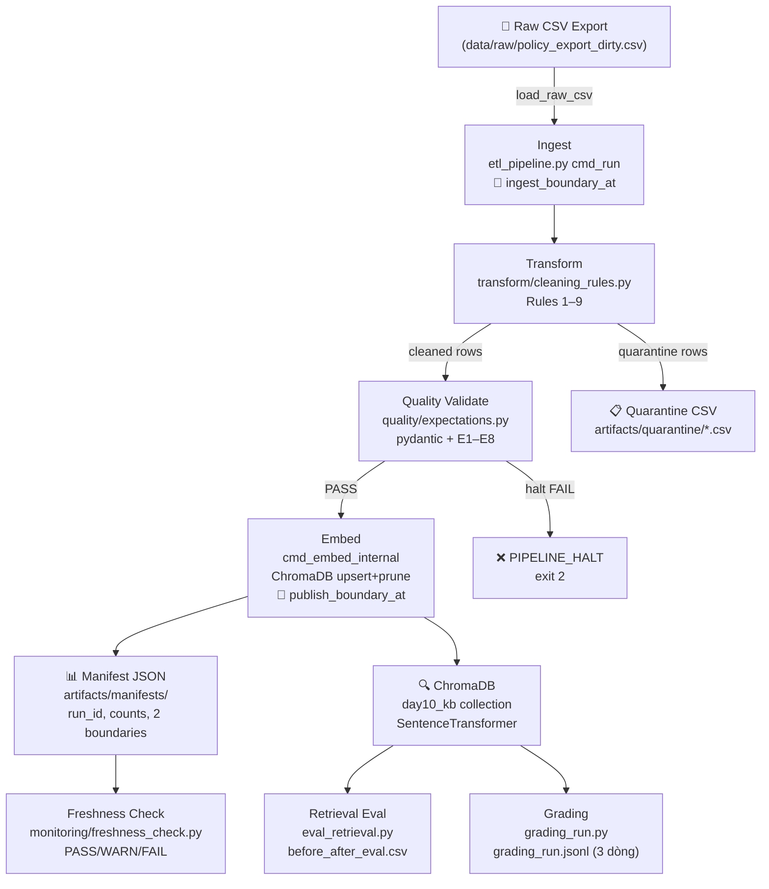

# Kiến trúc Pipeline — Lab Day 10
## Data Pipeline & Data Observability

**Nhóm:** 05-E402  
**Thành viên:** Trần Ngọc Huy · Nông Trung Kiên · Bùi Thế Công  
**Cập nhật:** 2026-04-15

---

## 1. Sơ đồ luồng (DAG)



**ASCII fallback (nếu Mermaid không render):**
```
Raw CSV
   │
   ▼ [ingest_boundary_at ← TIMESTAMP 1]
Ingest (etl_pipeline.py cmd_run)
   │
   ▼
Transform (cleaning_rules.py Rules 1–9)
   ├─[quarantine]→ artifacts/quarantine/*.csv
   │
   ▼
Quality (expectations.py pydantic + E1–E8)
   ├─[halt FAIL]→ PIPELINE_HALT exit 2
   │
   ▼ [publish_boundary_at ← TIMESTAMP 2]
Embed (ChromaDB upsert + prune stale IDs)
   │
   ├─→ Manifest JSON (run_id, counts, both boundaries)
   ├─→ Freshness Check (PASS/WARN/FAIL vs SLA 24h)
   ├─→ eval_retrieval.py → before_after_eval.csv
   └─→ grading_run.py → grading_run.jsonl (3 dòng)
```

---

## 2. Ranh giới trách nhiệm

| Thành phần | Input | Output | Owner nhóm | File |
|------------|-------|--------|------------|------|
| **Ingest** | `data/raw/policy_export_dirty.csv` | List[Dict] rows in memory | Trần Ngọc Huy | `etl_pipeline.py` `cmd_run()` |
| **Transform** | List[Dict] raw rows | (cleaned_rows, quarantine_rows) + CSVs | Nông Trung Kiên | `transform/cleaning_rules.py` |
| **Quality** | cleaned_rows | (results, should_halt) + log lines | Nông Trung Kiên | `quality/expectations.py` |
| **Embed** | cleaned_csv path | ChromaDB collection updated | Bùi Thế Công | `etl_pipeline.py` `cmd_embed_internal()` |
| **Monitor** | manifest JSON path | PASS/WARN/FAIL + age_hours (2 boundaries) | Bùi Thế Công | `monitoring/freshness_check.py` |

---

## 3. Idempotency & Rerun

**Chiến lược:** Upsert theo `chunk_id` + prune stale IDs.

**chunk_id generation:**
```python
chunk_id = sha256(f"{doc_id}|{chunk_text}|{seq}".encode()).hexdigest()[:16]
# → chunk_id ổn định giữa các lần chạy với cùng input
```

**Upsert flow:**
```
1. col.get(include=[])          → lấy tất cả IDs hiện có trong collection
2. drop = prev_ids - new_ids    → IDs không còn trong cleaned run này
3. col.delete(ids=drop)         → prune stale IDs
4. col.upsert(ids=new_ids, ...) → upsert toàn bộ cleaned rows
```

**Kết quả:** Chạy pipeline 2 lần liên tiếp với cùng input → collection count không đổi, không có vector trùng.

**Thử nghiệm:** Chạy `python etl_pipeline.py run` 2 lần → log `embed_prune_removed=0`, count nhất quán.

---

## 4. Liên hệ Day 09

- **Day 09** dùng `data/docs/*.txt` trực tiếp làm corpus (chunk bằng `LlamaIndex` hoặc split thủ công).
- **Day 10** thêm lớp **ingest từ CSV export** → clean → validate → embed vào ChromaDB riêng (`day10_kb` collection).
- Hai collection tách biệt: Day 09 dùng collection `day09_kb` (hoặc default), Day 10 dùng `day10_kb`.
- Day 10 pipeline **cung cấp dữ liệu sạch hơn**: stale refund window đã fix, HR bản cũ đã quarantine → nếu Day 09 agent dùng `day10_kb`, chất lượng retrieval cải thiện đo được qua `eval_retrieval.py`.

---

## 5. Rủi ro đã biết

| Rủi ro | Xác suất | Tác động | Giảm thiểu |
|--------|---------|---------|------------|
| Raw CSV thiếu doc_id mới | Trung bình | Quarantine nhiều → cleaned ít | Cập nhật `ALLOWED_DOC_IDS` trong `cleaning_rules.py` và `contracts/data_contract.yaml` |
| ChromaDB PersistentClient path sai | Thấp | Embed thất bại | Dùng env var `CHROMA_DB_PATH`, có `get_or_create_collection` |
| Freshness SLA quá chặt (<1h) | Thấp | False FAIL alert | Điều chỉnh `FRESHNESS_SLA_HOURS` env var |
| pydantic không cài | Thấp | Bonus +2 mất | Fallback về custom `run_expectations()` với warning |
| Encoding CSV không phải UTF-8 | Trung bình | Load fail hoặc BOM | Rule 7 bắt được BOM; `open(encoding="utf-8")` |

---

## 6. Biến môi trường quan trọng

| Biến | Default | Ý nghĩa |
|------|---------|---------|
| `CHROMA_DB_PATH` | `./chroma_db` | Đường dẫn PersistentClient |
| `CHROMA_COLLECTION` | `day10_kb` | Tên collection |
| `EMBEDDING_MODEL` | `all-MiniLM-L6-v2` | SentenceTransformer model |
| `FRESHNESS_SLA_HOURS` | `24` | SLA freshness (giờ) |
| `HR_LEAVE_MIN_EFFECTIVE_DATE` | `2026-01-01` | Cutoff bản HR cũ |
| `MIN_CHUNK_CHARS` | `20` | Độ dài tối thiểu chunk (Rule 8) |
